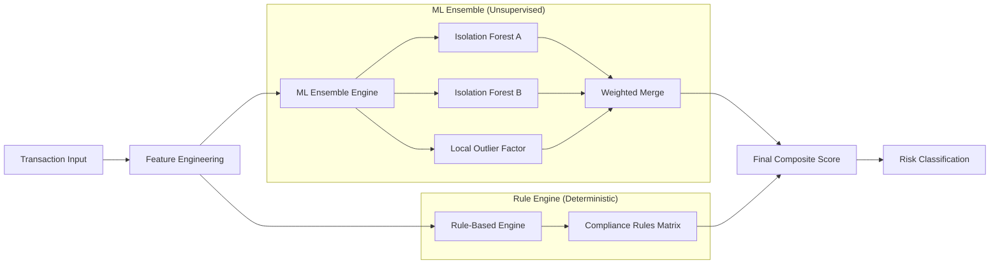

# AI Model Documentation: Hybrid Risk Assessment Engine

The TaxSentinel analysis engine utilizes a hybrid approach to transaction risk assessment, combining unsupervised machine learning (ML) for anomaly detection with a deterministic rule-based engine for compliance verification. This dual-engine architecture ensures that the system can detect both previously unseen fraud patterns and known regulatory violations.

## Engine Architecture

The scoring system operates on a composite model where the final risk score is derived from two independent sub-engines:

1.  **Machine Learning Engine (55% weight)**: Detects statistical outliers and structural anomalies in the transaction data.
2.  **Deterministic Rule Engine (45% weight)**: Validates transactions against hard-coded compliance thresholds and known fraud flags.

## 1. Feature Engineering

The system transforms raw transaction data into a high-dimensional feature space. This dimensionality expansion allows the models to capture complex interactions between variables.

| Feature Group | Key Parameters | Description |
| :--- | :--- | :--- |
| **Monetary** | `amount`, `tax_gap`, `profit_margin` | Baseline financial metrics of the transaction. |
| **Behavioral** | `tx_velocity`, `cash_ratio_monthly` | Temporal patterns and payment medium preferences. |
| **Structural** | `is_round_high`, `duplicate_flag` | Data integrity markers and abnormal reporting flags. |
| **Composite** | `cash_tax_interaction`, `velocity_amount` | Synthesized features capturing non-linear relationships. |
| **Network** | `client_concentration_ratio` | Measures entity dependency and potential shell company signals. |

## 2. Machine Learning Ensemble

The ML component uses an implementation of "voting" unsupervised models to produce a robust anomaly score.

### isolation Forest
The engine utilizes two Isolation Forest models with different contamination parameters. This algorithm partitions data points; anomalies are isolated more quickly (shorter paths) in the tree structure than normal points.

### Local Outlier Factor (LOF)
LOF measures the local density deviation of a given transaction relative to its neighbors. It helps detect transactions that are local outliers but might look normal in the global distribution.

### Score Normalization
Raw scores from these models are normalized to a 0-100 range using a combination of Z-score scaling and percentile mapping to ensure comparability across model versions.

## 3. Deterministic Rule Engine

The Rule Engine applies weighted penalties based on expert-defined thresholds. It acts as a baseline to capture high-confidence evasion patterns.

- **Tax Gap Multiplier**: Points added for discrepancies between declared and expected tax (up to 35 points).
- **Cash Thresholds**: High-value cash transactions incur significant risk weight (up to 30 points).
- **Velocity Spikes**: Penalties for rapid increase in transaction frequency (up to 25 points).
- **Pattern Matching**: Aggregated penalties for "Suspicious Pattern" counts derived from interaction terms.

## 4. Inference and Thresholding

The final score is calculated as:
`Final Score = (ML_Score * 0.55) + (Rule_Score * 0.45)`

Transactions exceeding the dynamic **Suspicious Threshold** are flagged for human review. The default threshold is calibrated to minimize false positives while maintaining a high recall for serious evasion attempts.

## 5. Explainability (Feature Contribution)

For every prediction, the system calculates the "Risk Contribution" of each feature. This is achieved by measuring the specific activation levels in the rule engine and the relative outlier scores in the ML ensemble, allowing analysts to see exactly WHY a transaction was flagged as high risk.
