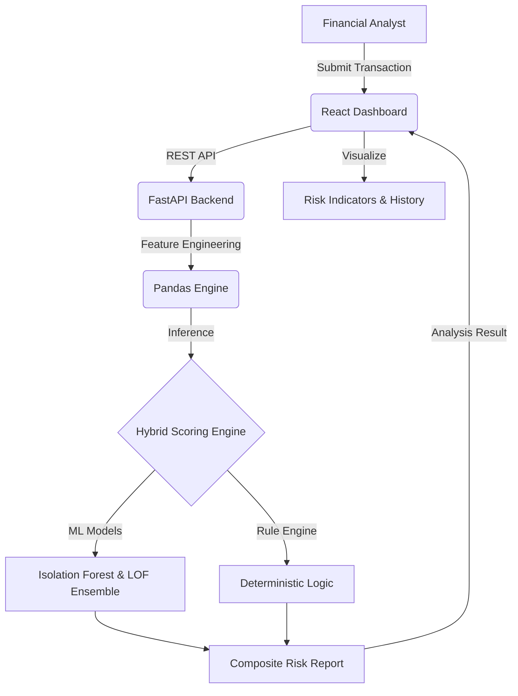

# Tax Anomaly Detection System


TaxSentinel is an enterprise-grade financial compliance platform that utilizes machine learning and deterministic rules to detect tax evasion and transaction anomalies in real-time. Built with a modern tech stack, it provides financial analysts with a sophisticated dashboard to analyze transaction risks, visualize anomaly scores, and maintain an audit trail of predictions.

## Project Architecture

The system is architected into two primary components:

1.  **Frontend (Client)**: A high-performance React application built with TypeScript and Tailwind CSS, providing a premium, interactive dashboard for data entry and risk visualization.
2.  **Backend (Inference Engine)**: A FastAPI-powered Python server that hosts the machine learning ensemble models and a deterministic rule engine for hybrid risk assessment.



## Tech Stack

### Frontend
- **Framework**: React 18 with Vite
- **Styling**: Tailwind CSS v4 (Global Design Tokens)
- **Icons**: Lucide React & React Icons
- **Routing**: React Router DOM
- **State Management**: React Hooks

### Backend
- **Framework**: FastAPI (Asynchronous Python)
- **ML Library**: Scikit-Learn (Isolation Forest, Local Outlier Factor)
- **Data Processing**: Pandas & NumPy
- **Storage/Serialization**: Joblib
- **Server**: Uvicorn

## Technical Details

For detailed information regarding the machine learning models, feature engineering, and the scoring algorithm, please refer to the [AI Model Documentation](model.md).

## Getting Started

### Prerequisites
- Node.js (v18+)
- Python (3.9+)
- pnpm or npm

### Setup Instructions

1.  **Clone the repository**:
    ```bash
    git clone https://github.com/your-repo/tax-anomaly-detection.git
    cd tax-anomaly-detection
    ```

2.  **Model Configuration**:
    Navigate to the `model` directory and set up the Python environment:
    ```bash
    cd model
    python -m venv venv
    source venv/bin/activate  # On Windows: venv\Scripts\activate
    pip install -r requirements.txt
    ```

3.  **Run Backend Server**:
    ```bash
    uvicorn app:app --reload --port 8000
    ```

4.  **Client Configuration**:
    Navigate to the `client` directory and install dependencies:
    ```bash
    cd ../client
    pnpm install  # or npm install
    ```

5.  **Run Frontend Development Server**:
    ```bash
    pnpm run dev
    ```

## Key Features

<div align="center">
    


</div>

- **Hybrid Inference**: Combines unsupervised anomaly detection (ML) with expert-defined compliance rules.
- **Real-Time Analysis**: Instant risk scoring upon transaction submission.
- **Audit Logging**: Maintains a comprehensive history of all analyzed transactions.
- **Explainability**: visualization of top risk factors and how they contribute to the final score.
- **Responsive Design**: Optimized for both desktop and mobile compliance officers.

## Data Processing Pipeline

1.  **Input Validation**: Strict schema validation ensures only high-quality data enters the pipeline.
2.  **Feature Engineering**: Raw transaction data is transformed into 15+ composite features (interaction terms, ratios, velocity signals).
3.  **Scaling**: Robust scaling architecture handles varied data distributions across transaction types.
4.  **Ensemble Scoring**: Multiple models vote on the anomaly score to reduce false positives.
5.  **Risk Classification**: Scores are mapped to LOW, MEDIUM, and HIGH risk buckets based on dynamic thresholds.

## Contributors

- Atharva kote
- Bhushan korde
- Saraj Naikwade
- Pranav Mulay
